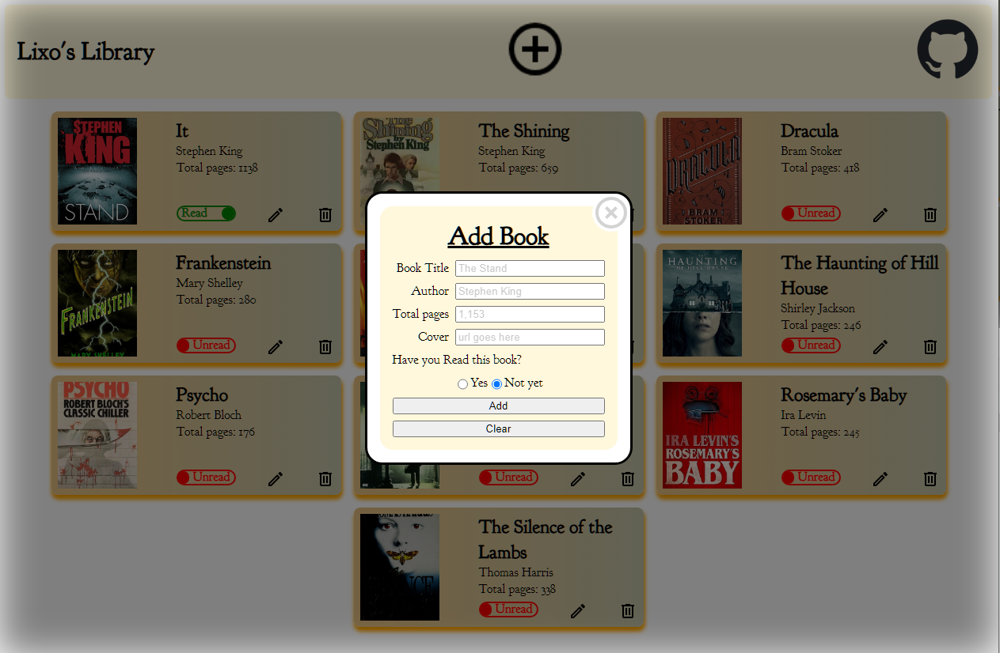

# Project: Library (Frontend) - The Odin Project

    

<h2 align="center">
<a href="https://lixoten.github.io/library-app-odin/">DEMO</a>
</h2> 

## Project Overview
Lixo's Library App is a web application designed to manage a personal library collection.
The app allows the used to manage a personal library collection. The user can add, edit, and remove books from their library, making it easy to keep track of their reading materials. 

## Curriculum and Topics Explored
This project focuses on demonstrating various full-stack JavaScript concepts, including responsive design, dynamic content management, and interactive user interfaces. The goal is to showcase the ability to build a functional web application using modern web technologies.  
The following subjects and technologies were covered during the development of the Library App:

- **Front-End Development**: Building the user interface using HTML, CSS, and JavaScript.
- **Responsive Design**: Creating a layout that adapts to different screen sizes and devices.
- **Back-End Development**: Handling dynamic content and user interactions through JavaScript.
- **Web Storage**: (Coming soon, in next course at TOC) Implementing local storage to persist data across sessions.
- **Event Handling**: Managing user events such as clicks and form submissions.
- **DOM Manipulation**: Dynamically updating the webpage content based on user actions.
- **JavaScript Functionality**: Showcases the use of JavaScript for powering the application's interactivity, such as form validation, dynamic content updates, and event handling.
- **Custom Properties (CSS Variables):** Used for consistent styling.
- **Styling and Animations**: Demonstrates the use of CSS for styling, including animations, gradients.

### Project Specification
[Project: Library](https://www.theodinproject.com/lessons/node-path-javascript-library)

### Notes

Ideas and things we can go to improve
* Coming soon
  * Saving the data to local or session. Covered in coming Topic in TOC
* Features
  * Favorite Tag
  * Rating System
  * Page Filter that would allow used to filter loaded pages
  * Search Feature
  * A stat page with things like total books, # of read/unred, # of favorites 

